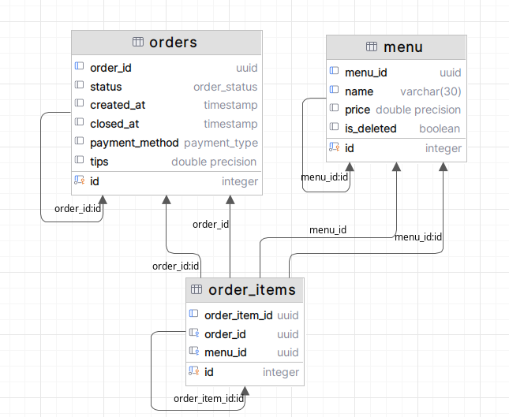
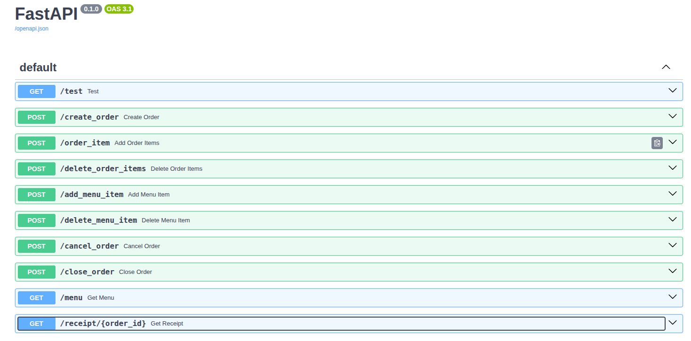

# POS System API

**REST API для автоматизации работы ресторана** с функционалом:
- Создание/закрытие заказов
- Добавление/удаление пунктов заказа
- Управление меню (добавление/удаление позиций)
- Формирование чеков

## Технологии
- Python 3.11+
- FastAPI
- PostgreSQL
- AsyncPG
- Pydantic
- UUID

## Установка
1. Клонировать репозиторий:
   ```sh
   git clone git@github.com:AlinaSeny/pos-api.git
   cd pos-api
   
2. Настроить БД (запустите db_creation_script.sql в PostgreSQL).

3. Установить зависимости:
    ```sh
    pip install -r requirements.txt
   
4. Запустить сервер:
    ```sh
    uvicorn main:app --reload


## API Endpoints

### Основные операции
| Метод | Эндпоинт              | Описание                          |
|-------|-----------------------|-----------------------------------|
| POST  | `/create_order`       | Создать новый заказ               |
| POST  | `/order_item`        | Добавить блюдо в заказ            |
| POST  | `/close_order`       | Закрыть заказ с оплатой           |
| GET   | `/receipt/{order_id}`| Получить чек по ID заказа         |

### Управление меню
| Метод | Эндпоинт          | Описание                     |
|-------|-------------------|------------------------------|
| POST  | `/add_menu_item`  | Добавить блюдо в меню         |
| POST  | `/delete_menu_item` | Удалить блюдо (soft delete)  |
| GET   | `/menu`           | Получить актуальное меню     |

## Примеры запросов

### Создание заказа
```http
POST /create_order
```
**Ответ:**
```json
{"order_id": "a3d8e9b0-5c1f-4e7d-b2a9-6c3f0b8e1d2a"}
```

### Добавление блюд в заказ
```http
POST /order_item
Content-Type: application/json

{
  "order_id": "a3d8e9b0-5c1f-4e7d-b2a9-6c3f0b8e1d2a",
  "items": [{"menu_id": "b4e2f8c1-9d3a-4f6b-8c2d-7e1f5a3b6d9c"}]
}
```

### Закрытие заказа
```http
POST /close_order
Content-Type: application/json

{
  "order_id": "a3d8e9b0-5c1f-4e7d-b2a9-6c3f0b8e1d2a",
  "payment_method": "card",
  "tips": 150
}
```

## Тестирование
Запуск unit-тестов:
```sh
pytest unit_test.py -v
```
Тесты покрывают:
- Создание заказа
- Добавление/удаление позиций
- Закрытие заказа
- Работу с меню

## База данных
Схема БД:



## Документирование API в Swagger UI (локальный хост)

